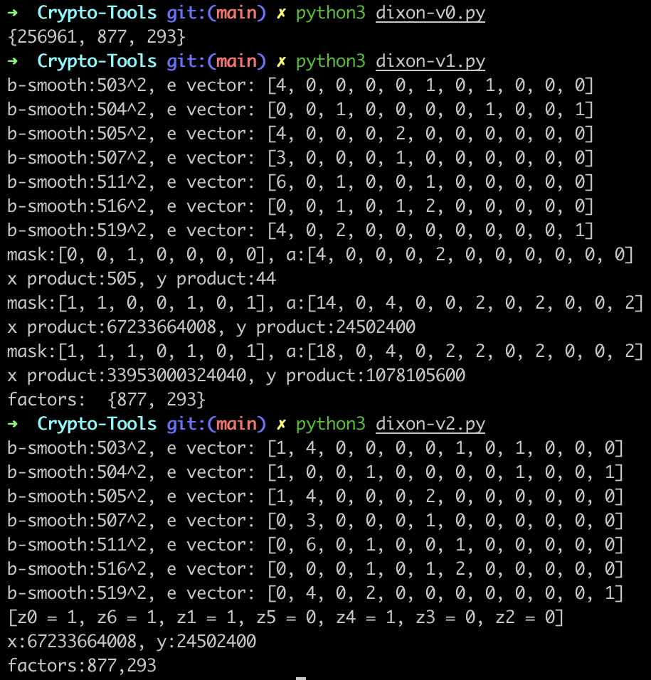

# Crypto-Tools

Crypto tools

## Shift Cipher: Exhaustive Key Search

`shift-ekey-search.py`

Exhaustive key search for Shift Cipher.

$\mathbb{C}=\mathbb{P}=\{A,B,...,Z\}$

## Vigenère: Friedman's Attack

`vigenere-friedman.py`

$\mathbb{C}=\mathbb{P}=\{A,B,...,Z\}$

Ref:
https://en.wikipedia.org/wiki/Letter_frequency
https://github.com/cbornstein/python-vigenere/blob/master/vigenere.py

## OTP: Encryption Matrix

`OTP-encryption-matrix.py`

$\mathbb{P} = \mathbb{C}$ $= \mathbb{K} $ $=(\mathbb{Z_{2}})^n$

$x=\{x_1,...,x_n\}$, $K=\{K_1,...,K_n\}$

$e_K(x)=x\ \oplus K$

$d_K(y)=y\ \oplus K$

## DES: Round Key Schedule

`DES-key.py`

## AES128: Round Key Schedule

`AES128-key.py`

## RSA

`egcd()` extended euclidean algorithm

Input: a, b (a > b)
Output: x, y, where ax + by = gcd(a, b)

`solve_congruences_system()`

Use Chinese Remainder Theorem to solve a system of congruences:
The system of r congruences $x \equiv a_i (\mod m_i), 1 \le i \le r$
has a unique solution modulo $M = m1 * m2...*m_r$, which is given by
$X = \sum_{i = 1}^{r} a_i\ M_i\ y_i (\mod M)$
Where $M_i = M/m_i$ and $y_i = M_i^{-1}(\mod m_i), 1 \le i \le r$

Input: a[], m[], where m[i], m[j] are pair-wise relatively prime

`calc_keys()`

Calculate keys
Input: p, q
Choose: e = 65537
Output: N, phi_N, d
pubkey: (N, e)
prikey: (N, d) 

**RSA Key generation algorithm (original):**

- Generate 2 large random primes, p and q, of approximately equal size such that their product n=pq is of the required bit length
- Compute N=pq and $\phi(N)$ =(p−1)(q−1)
- Choose an integer e, $1 \lt e \lt \phi(N)$, such that gcd(e, $\phi(N)$) = 1
- Compute the secret exponent d, $1 \lt d \lt \phi(N)$, such that $ed \equiv 1 \mod \phi(N)$
- The public key is (N, e) and the private key is (d, p, q). Private key also can be written as (N, d)

e can be chosen from 3,5,17,257,65537

**Encryption**

Input: pubkey + plaintext

$c = m^e \mod N$

m - plaintext (int)
c - ciphertext (int)

**Decryption**

Input: prikey + ciphertext

$m = c^d \mod N$

**Rainbow table**

`RSA-decryption-table.py`: generate decryption table (`RSA-dec-table.txt`)

`RSA-dec-table.txt`: then decryption table

**Hastad's Broadcast attack**

`hastad-broadcast-attack.py`

`hastadBroadcastAttack()` in `RSA.py`

## Pollard’s Rho Algorithm

for factorization

## Dixon's Random Squares Method

Idea: construct $n = x^2 - y^2 = (x + y)(x - y) $ for factorization

Find $x, y$ with $x \ne \pm y (\mod n)$ and $x^2 \equiv y^2 (\mod n)$

So $x^2 - y^2 = (x+y)(x-y) \equiv 0 (\mod n)$

$\because x \pm y \not\equiv 0(\mod n)$

$\therefore gcd(x \pm y, n)$ are non-trivial factors for $n$

-----

Given $n$, $T=\{z_1, z_2, ... ,z_k\}$, $B=\{p_1, p_2, ... ,p_k\}$(Base)

$z_i^2 \equiv p_1^{e_1} p_2^{e_2} ... p_k^{e_k} (\mod n)$

Assign exponent vector to the right-hand side of the congruence:

$a_i = (e_1, e_2, ..., e_k)$

Multiplying right-hand sides <-> Adding exponent vactors

Perfect square <-> Exponent vector with even components

-----

**Recipes of T**

- $z = j + \lceil \sqrt{kn} \rceil (\mod n)$, $j = 0,1,...$, $k = 1,2,...$. Yields $z^2 (\mod n)$ that are small
- $z = \lfloor \sqrt{kn} \rfloor (mod n)$, $k = 1, 2, ...$. Yields $-z^2(\mod n)$ that are small

-----

**Factor-Base B**

Factor base is a small set of prime numbers

----

- v0: simply 2 loops
- v1: find the power set of the set containing all exponent vectors. For each subset, check whether the perfect square can be constructed.
- v2: according to the exponent vectors, set constraints and solve with `z3` solver

## ElGamal

`elGamal.py`

Let $p$ be a large prime, and $\alpha \in \mathbb{Z}_p$ a prime element.

Define the plaintext space as $\mathbb{P} = \mathbb{Z}_p*$

Set the keyspace as $\mathbb{K} = \{(p, \alpha, a, \beta): \beta \equiv \alpha^a (\mod p) \}$

PubKey: $(p, \alpha, \beta)$

PriKey: a, the secret exponent

Encryption: $e_k(x, k) = (y_1, y_2)$, where $y_1 \equiv a^k (\mod p)$ and $y_2 \equiv x \beta^k (\mod p)$

Decryption: take $(y_1, y_2) \in \mathbb{C}$, $d_k(y_1, y_2) = y_2(y_1^a)^{-1} (\mod p)$

## Shanks Baby Step Giant Step

`shanks.py`

Find x, such $\alpha^x \equiv \beta (\mod p)$

$x = log_{\alpha} \beta$

p should be prime